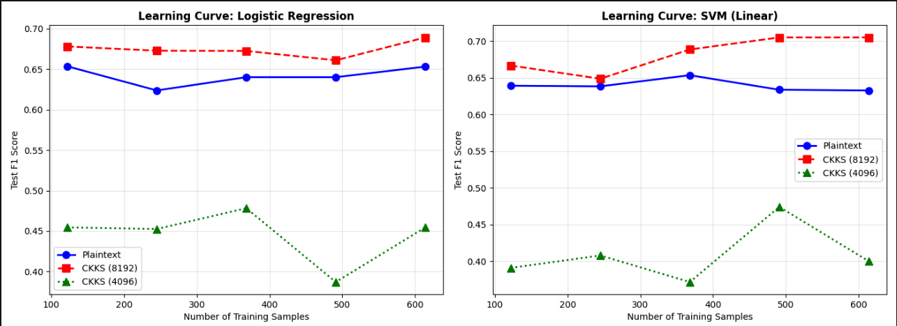
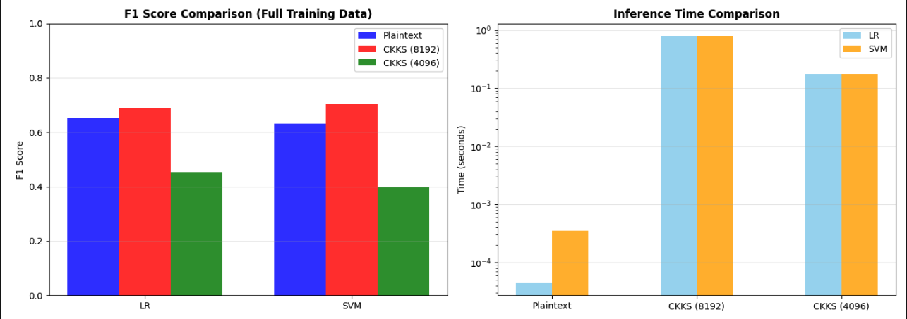

# Privacy-Preserving Machine Learning
## Exploring Homomorphic Encryption for Medical Diagnosis
**Matthew Townsend**
**CS540 AI Project**

---


## Dataset

- **Source**: UCI Diabetes Dataset (`diabetes.csv`)
- **Task**: Binary classification (Diabetes presence vs. absence)
- **Features**: 8 medical attributes (glucose, blood pressure, BMI, etc.)
- **Samples**: ~768 total (614 train, 154 test at 80/20 split)
- **Preprocessing**: StandardScaler normalization

---

## Plaintext Model Training 

```python
lr = LogisticRegression(max_iter=1000, random_state=13)
svm = SVC(kernel='linear', random_state=13)
```

- Trains two linear models on plaintext data
- **Logistic Regression**: Probabilistic classifier with learned weights
- **SVM (Linear Kernel)**: Maximum margin classifier
- Both are compatible with HE because they only require dot products + bias (no non-linear activations)

**Why Linear Models?** Non-linear activation functions (ReLU, sigmoid) are expensive to compute in the encrypted domain and introduce significant noise/performance penalties.

---

## Homomorphic Encryption (HE)

Allows computation on encrypted data **without decrypting it**:
- Plaintext: `z = a·x + b`
- Encrypted: `Enc(z) = Enc(a)·Enc(x) + Enc(b)` ✓ Same result when decrypted

### CKKS Scheme

- **Approximate arithmetic** (slight rounding errors)
- **Supports addition and multiplication** on encrypted numbers
- **Scales by 2^p** to handle fractional arithmetic
- **Noise grows** with each operation; eventually swallows signal

---

## CKKS (8192) - High Precision
```python
poly_mod_degree_8192 = 8192
coeff_mod_bit_sizes_8192 = [60, 40, 40, 60]
enc_training_ckks_8192.global_scale = 2 ** 40
```

- **Polynomial Degree**: Larger N = higher capacity and precision, but slower computation
- **Coefficient Moduli**: Larger bit sizes provide more "room" for numbers before overflow
- **Global Scale**: Fractional precision in encrypted arithmetic (~1 trillion scale factor)
---
## CKKS (4096) - Lower Precision
```python
poly_mod_degree_4096 = 4096
coeff_mod_bit_sizes_4096 = [40, 21, 21, 21, 21, 40]
enc_training_ckks_4096.global_scale = 2 ** 20
```

- **Polynomial Degree**: Half the capacity of 8192, faster but noisier
- **Smaller coefficient moduli**: Less precision available
- **Lower scale**: Reduced fractional precision (~1 million scale factor)

**Purpose**: This creates an intentional "precision gap" to demonstrate how HE performance degrades with reduced security margins.

---

## Threshold Calibration 

```python
threshold_lr_ckks = np.mean(y_lin_enc_train_lr)
```

- Computes the encrypted predictions on 50 training samples
- Takes the mean as the decision boundary
- In HE, decryption can introduce minor noise. We calibrate the threshold to the encrypted domain to ensure fair comparison.

---

##  Homomorphic Inference 

For each model (LR/SVM) and context (8192/4096):

```python
sample_enc = ts.ckks_vector(enc_training_ckks_8192, X_test_scaled[i])
y_lin_enc = sample_enc.dot(lr_weights) + lr_bias  # Encrypted dot product
y_lin_dec = y_lin_enc.decrypt()                    # Decrypt result
y_pred = 1 if y_lin_dec[0] > threshold else 0     # Thresholded classification
```

- **ts.ckks_vector()**: Encrypts plaintext feature vector
- **.dot()**: Computes encrypted dot product (weights · features)
- **decrypt()**: Returns ciphertext to plaintext (only private key can do this)
- All operations are mathematically equivalent to plaintext computation, but with added noise

---

## Learning Curves 

Iterates over 5 training set sizes (20%, 40%, 60%, 80%, 100%):

1. **Trains new models** on each subset
2. **Calibrates new thresholds** for both CKKS contexts (separate calibration per subset)
3. **Evaluates all 6 combinations** on the full test set
4. **Stores F1 scores** to track how performance changes with training data volume

**Key Insight**: The learning curves reveal whether HE models can improve with more training data or if they're fundamentally limited by encryption noise.

---
## 



---
##



---

## Performance Gap Analysis

Plaintext vs. CKKS performance gaps indicate:
- **8192 > 4096**: Higher polynomial degree reduces noise
- **Small gap (<5%)**: HE viable for this task
- **Large gap (>20%)**: Noise floor dominates; dataset/model not suitable for HE

### Timing Comparison

- Plaintext: <1 millisecond per sample
- HE: 500ms - 1s per sample
- Speedup needed: ~1000-10000x to make HE practical for real-time inference

---

## Conclusion

This project demonstrates the **fundamental tradeoff in HE**:
- **Security**: Data stays encrypted; server never sees plaintext
- **Accuracy**: Noise from encryption reduces model performance
- **Speed**: Encrypted operations 1000x+ slower than plaintext

HE is ideal for **privacy-critical, latency-tolerant** applications (e.g., outsourced analysis of sensitive medical data). For real-time inference, traditional encryption (TLS) + secure enclaves remain superior.

---

## References

- **TenSEAL**: https://github.com/OpenMined/TenSEAL
- **CKKS Scheme**: Cheon et al. (2017) "Homomorphic Encryption for Arithmetic of Approximate Numbers"
- **Diabetes Dataset**: UCI ML Repository

